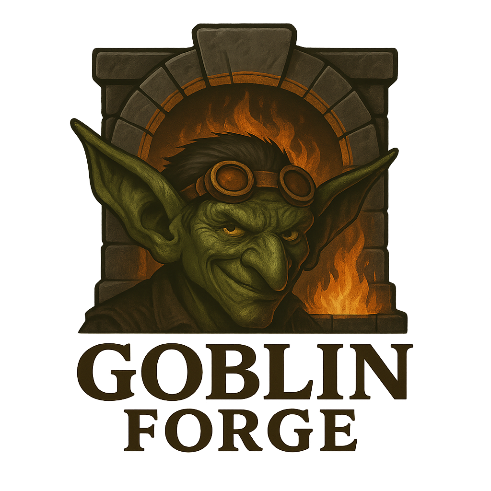

# Goblin Forge

[](https://www.python.org/downloads/)
[](LICENSE)
[](https://github.com/yourusername/goblin-forge/actions)
[](https://github.com/yourusername/goblin-forge/wiki)




A Python-based web application designed to simplify executing CLI binaries through an intuitive, visually appealing, and menu-driven web interface.

## Quick Links

- [Features](#features)
- [Installation](#installation)
- [Getting Started](#getting-started)
- [Architecture](#system-architecture)
- [Plugins](#plugins)
- [Contributing](#contributing)
- [Support](#support)
- [License](#license)

## Features

- 🚀 **Intuitive Web Interface**: Easy-to-use tabbed interface for accessing different tools
- 🔌 **Plugin Architecture**: Extend with custom tools via the Goblin Gadgets plugin system
- ⚡ **Concurrent Execution**: Process multiple tasks simultaneously with resource-conscious worker management
- 📁 **Organized Results Storage**: Automatic saving and organization of execution outputs
- 🎛️ **Mode-based Configuration**: Each tool can expose multiple operational modes with customized parameters
- 📤 **File Upload Support**: Upload and process files directly through the web interface
- 🔄 **Task Management**: Monitor, cancel, and retry tasks with ease
- 📊 **Results Visualization**: View and analyze execution results in a user-friendly format

## Getting Started

### Prerequisites

- Python 3.8+
- Node.js 14+
- Redis (for Celery task queue)

### Quick Installation

```bash
# Clone the repository
git clone https://github.com/yourusername/goblin-forge.git
cd goblin-forge

# Create and activate virtual environment
python -m venv venv
source venv/bin/activate  # On Windows: venv\Scripts\activate

# Install dependencies
pip install -r requirements.txt
cd frontend && npm install
```

### Running the Application

1. Start Redis:
   ```bash
   redis-server
   ```

2. Start Celery Worker (Minions):
   ```bash
   celery -A goblin_forge.core.minion_manager.celery_app worker --loglevel=info
   ```

3. Start Backend Server:
   ```bash
   uvicorn goblin_forge.api.main:app --reload --host 0.0.0.0 --port 8000
   ```

4. Start Frontend Development Server:
   ```bash
   cd frontend && npm start
   ```

Visit http://localhost:3000 to access the application.

## System Architecture

Goblin Forge follows a modern, modular architecture:

### Components

- **Backend**: FastAPI for modern, async-friendly REST API
- **Frontend**: React with Bootstrap for a clean, responsive UI
- **Worker Management**: Celery with Redis for task queuing and concurrent processing
- **Plugin System**: Dynamic Python module loading for Goblin Gadgets
- **Results Management**: Automated storage and cleanup of execution results

### Directory Structure

```
goblin_forge/
├── api/                    # FastAPI application and endpoints
├── core/                   # Core functionality
│   ├── minion_manager.py   # Worker process management
│   ├── results_manager.py  # Results handling
│   └── plugin_loader.py    # Plugin discovery and loading
├── plugins/                # Goblin Gadgets
├── frontend/               # React application
├── tasks/                  # Celery task definitions
├── utils/                  # Helper utilities
└── results/                # Execution results storage
```

## Plugins

Goblin Forge's plugin system, called "Goblin Gadgets," allows you to extend the platform with new tools. Each gadget can have multiple operation modes and custom parameters.

### Available Plugins

- **Scanner Gadget**: Network scanning and analysis
- **Encoder Gadget**: Text encoding and decoding
- **File Processor**: File analysis and conversion

### Creating Plugins

See [Creating Plugins](adding_plugins.md) for detailed instructions on creating your own gadgets.

## Results Management

Goblin Forge automatically manages execution results in the `results` directory:

```
results/
  task_id/
    input/          # Input files
    output/         # Output files
    analysis.json   # Analysis results
```

Results are automatically cleaned up after a configurable retention period.

## Contributing

We welcome contributions! Please see our [Contributing Guidelines](CONTRIBUTING.md) for details.

1. Fork the repository
2. Create your feature branch (`git checkout -b feature/amazing-feature`)
3. Commit your changes (`git commit -m 'Add some amazing feature'`)
4. Push to the branch (`git push origin feature/amazing-feature`)
5. Open a Pull Request

## Support

- [Documentation](https://github.com/yourusername/goblin-forge/wiki)
- [Issue Tracker](https://github.com/yourusername/goblin-forge/issues)
- [Discussions](https://github.com/yourusername/goblin-forge/discussions)

## Roadmap

- [ ] Enhanced plugin management
- [ ] Improved results visualization
- [ ] Advanced file processing capabilities
- [ ] Plugin marketplace
- [ ] API documentation
- [ ] Performance optimizations

## License

This project is licensed under the MIT License - see the [LICENSE](LICENSE) file for details.

## Acknowledgments

- FastAPI for the excellent web framework
- React for the frontend framework
- Celery for task queue management
- Redis for the message broker